# 📖 Zomato CSAO: Culturally Intelligent Recommendation Engine

<div align="center">
  
  <p><b>A production-grade ML engine to intelligently suggest complementary food items (add-ons) to a user's cart.</b></p>
</div>

---

## 🚀 Quick Start (In 3 Steps)

1. **Install Dependencies**
   ```bash
   pip install -r requirements.txt
   ```
2. **Train the Models (Builds the Brain)**
   ```bash
   python run_full_pipeline.py
   ```
   *(Synthesizes 15k orders, generates embeddings, trains LambdaMART)*
   
3. **Launch the Zomato API & UI**
   ```bash
   python api/app.py
   ```
   👉 **Open [http://127.0.0.1:8000/](http://127.0.0.1:8000/) in your browser!**

---

## 🧠 The "Two-Stage" Architecture

We solved the "Generic Match" crisis (where the model suggests Pizza when you order Butter Chicken) by implementing a strict **Two-Stage Machine Learning Pipeline** capable of scaling to millions of users under a 300ms latency budget.

```mermaid
graph TD
    A["🛒 User Cart"] -->|"1. Weighted Pooling"| B("Context Vector")
    B -->|"2. Exact Cuisine Match + Cosine Similarity"| C{"Stage 1: Retrieval"}
    C -->|"Top 50 Candidates"| D("Transformer Embeddings")
    D --> E{"Stage 2: Ranking"}
    E -->|"LightGBM LambdaMART"| F("User Segment, Time, Price, Veg Logic")
    F -->|"Diversity Constraint"| G["🏆 Top 8 Recommendations"]
```



### 🎯 The Secret Sauce: Popularity Penalty
To avoid recommending "Water" or "Coke" every single time, we applied a **Popularity Penalty (`-0.1` alpha)**. This forces the model to discover unique, high-margin, culturally accurate pairings (like *Raita* with *Biryani*).

---

## 📊 Where to Find the Results

For reviewers looking for the math, our blind tests and evaluation outputs are securely logged in the `2_Evaluation_Results/` and `4_Business_Impact_Analysis/` folders:

- 📈 **HitRate & NDCG:** `model_performance_metrics.txt`
- 🧪 **Blind Generalization:** `blind_test_metrics.txt`
- 💰 **AOV Lift Projections:** `projected_lift_and_acceptance.txt`
- ⚡ **Latency Profiles:** `operational_metrics.txt`

---

## 🖼️ Sample Outputs

*(The system predicts dynamically for North Indian, South Indian, Indo-Chinese, Italian, and Desserts)*


---

## 🌍 Enterprise Scalability Blueprint
*How this scales from MVP to Zomato Production:*

1. **Vectors:** `cosine_similarity` ➡️ **FAISS / Milvus** (Billion-scale retrieval in <10ms).
2. **Features:** On-the-fly math ➡️ **Redis Feature Store** (Instant lookups).
3. **Data:** Local CSVs ➡️ **Snowflake / S3 Data Lakes**.
4. **Maintenance:** Sync generation ➡️ **Apache Airflow Async Batching**.

---
*Built for the Zomato CSAO Hackathon.*
**MIT License © 2026 VanguardLogic**
