# 📖 CSAO (Cross-Selling & Add-on Optimization)
## *A Cart-Context Recommendation Engine*

Welcome to the **Cross-Selling & Add-on Optimization (CSAO)** project repository. This project demonstrates a machine learning pipeline designed to suggest complementary food items (add-ons) based on a user's current cart.

This README provides a guide to understanding the engine, how it works, the repository layout, and instructions for running the system locally.

---

## 🌑 The Problem Statement
At the start of this project, we faced a "Generic Fallback" problem. With a small catalog (~50 items) and simple logic, the system suffered from:
1.  **Cuisine Mismatches:** Recommending a MARGHERITA PIZZA for a user ordering BUTTER CHICKEN.
2.  **The "Fries & Coke" Trap:** Globally popular items overwhelmed specific pairings.
3.  **Synthetic Data Inflated Metrics:** Our offline evaluation trained on highly specific synthetic probability functions representing our assumptions of food delivery traffic. The model's final metrics (AUC ≈ 0.93, HitRate@8 ≈ 99%) represent its mastery over these tight synthetic patterns. In a production scenario with "noisy" real human data, a HitRate@10 ≈ 40-70% is standard and expected.

---

## 🧠 How It Works

To solve the issue, we moved away from manual tags and implemented a **Two-Stage Machine Learning Pipeline** using semantic item embeddings.

```mermaid
graph TD
    A["🛒 User Cart"] -->|"1. Weighted Pooling"| B("Context Vector")
    B -->|"2. Exact Cuisine Match + Cosine Similarity"| C{"Stage 1: Retrieval"}
    C -->|"Top 50 Candidates"| D("Transformer Embeddings")
    D --> E{"Stage 2: Ranking"}
    E -->|"LightGBM LambdaMART"| F("Price, Veg Logic, Popularity, Affinity")
    F -->|"Diversity Constraint"| G["🏆 Top 8 Recommendations"]
```



### 1. High-Level Overview
Imagine you are at a restaurant. If you order "Butter Chicken," the system shouldn't offer you a Slice of Pizza. It should offer "Garlic Naan" or "Jeera Rice." 
Our system handles this by:
- **Filtering by cuisine**: It groups items by cuisine (North Indian, Italian, Desserts) so it doesn't mix incompatible foods.
- **Checking dietary logic**: It checks if the cart is vegetarian and adjusts the suggestions.
- **Learning relationships**: It uses historical data to learn that "Momos" go well with "Manchow Soup." 
- **Retrieving and Ranking**: First, it pulls a list of 50 items that make logical sense. Then, it ranks those 50 items to give the best 8 recommendations.

### 2. Technical Details
The recommendation system uses a **Two-Stage Recommendation Funnel Pipeline**:

*   **Stage 1: Candidate Retrieval (Vector Search)**
    *   We expanded the catalog from **50 to 300+ items** across 7 distinct cuisines to create dense semantic clusters.
    *   **The Brain (Embedding Model):** We use **`sentence-transformers/all-MiniLM-L6-v2`** to generate **384-dimensional dense semantic vectors** for every dish. This is what allows the AI to truly "understand" the ingredients and culinary profile of the food, rather than relying on manual tags.
    *   **Context Vector Engine:** We apply **Weighted Sequential Pooling** to the user's cart items. The last item added carries 50% of the weight, and the mean of all previous items carries the other 50%. This creates a dynamic, rolling "Context Vector."
    *   **Strict Cuisine Filtering (Stage 0):** This ensures we only retrieve the top 50 candidates that share the *same dominant cuisine* as the cart, plus global items (Beverages/Desserts). We compute mathematically fast Cosine Similarity between the 384d Cart Vector and all allowable dish vectors to fetch these 50 candidates.
*   **Stage 2: Candidate Ranking (LightGBM LambdaMART)**
    *   The 50 candidates are passed to a highly-tuned **LightGBM Ranker** model.
    *   The model evaluates multiple complex features: Cart Total Value, Dish Popularity, Vegetarian Constraints, and Embedding Affinity Scores.
    *   It outputs a final probability score for each item, which is then passed through a **Diversity Constraint** (e.g., maximum 2 beverages allowed) to produce the final Top 8 recommendations.
*   **Final Polish:** A **Popularity Penalty** (`-0.1` alpha) is applied to global generic items (Water, Coke) to force the engine to discover unique, high-margin pairings (like Raita or Garlic Naan).

---

## 📂 Repository Layout

This repository is structured around the required submission points:

*   `1_Model_Development/`
    *   **`data_prep/`**: Scripts for synthesizing and generating order histories.
    *   **`offline_pipeline/`**: The core ML pipeline scripts (`build_graph.py`, `train_ranker.py`).
    *   **Hyperparameter Tuning:** Check `hyperparameter_tuning_approach.txt` for details.
*   `2_Evaluation_Results/`
    *   **Metrics output.** This folder contains Python scripts that run evaluations and the resulting text files (`model_performance_metrics.txt`, `blind_test_metrics.txt`).
*   `3_Documentation/`
    *   **System Architecture.** Text files explaining the design, evaluation frameworks, and scalability constraints.
*   `4_Business_Impact_Analysis/`
    *   **Business Metrics.** Files detailing AOV (Average Order Value) lift projections and segment performance.
*   `api/`
    *   **Live App.** Contains `app.py`—a FastAPI app that serves the frontend UI and inference endpoint at `POST /api/recommend`.
*   `data/`
    *   *(Auto-generated during pipeline run)* Contains the CSV datasets and the serialized `.pkl` models.

---

## 📈 Where to Find the Metrics

For judges and reviewers looking to validate our results, please check these specific files within the repository:

*   **Model Performance (HitRate, NDCG, AUC-ROC):** 
    👉 `2_Evaluation_Results/model_performance_metrics.txt`
*   **Blind Test Generalization (AUC, HitRate):** 
    👉 `2_Evaluation_Results/blind_test_metrics.txt`
*   **AOV Lift & Revenue Projections:** 
    👉 `4_Business_Impact_Analysis/projected_lift_and_acceptance.txt`
*   **Speed and Operational Latency Profiles:** 
    👉 `2_Evaluation_Results/operational_metrics.txt`
*   **Error Analysis & Baseline Comparisons:** 
    👉 `2_Evaluation_Results/error_analysis_and_insights.txt` and `2_Evaluation_Results/comparison_with_baseline.txt`

---

## 🚀 How to Run the Project

Follow these steps to generate data, train the model, and launch the live API interface on your local machine.

### Prerequisites
Make sure you have Python 3.9+ installed. Install the dependencies:
```bash
pip install -r requirements.txt
```

### 1. Run the Full ML Training Pipeline
This single orchestration script handles directory setup, synthesizes 15,000+ orders, generates transformer embeddings, and trains the LambdaMART ranker from scratch.
```bash
python run_full_pipeline.py
```
*Depending on your hardware, this might take 2-5 minutes to complete.*

### 2. Start the Live Recommendation API
Once the pipeline has successfully produced the `.pkl` and `.json` artifacts in the `data/` folder, start the API:
```bash
python api/app.py
```

### Option 2: Run via Docker

If you have Docker installed, you can spin up the entire pre-configured environment in one command:

```bash
# 1. Build the image
docker build -t csao-engine .

# 2. Run the container
docker run -p 8000:8000 csao-engine
```

---

## 🖥️ Using the UI

Open your web browser and navigate to:
**[http://127.0.0.1:8000/](http://127.0.0.1:8000/)**

Enter a sample cart like `Butter Chicken, Garlic Naan` to see the recommended add-ons.

---

## The model can predict for various cuisine types like north Indian, South Indian, Indo-Chinese , Italian and desserts.
---


## 🌍 Future Scaling

While this MVP is built on an in-memory graph of ~300 items, the ML architecture can scale:

1. **Data Pipeline:** Item metadata and order log histories will stream from S3 Data Lakes or Snowflake.
2. **Retrieval (Vector DB):** In production, the in-memory search is replaced by an ANN Vector Database like FAISS or Milvus to pull candidates from millions of dishes quickly.
3. **Ranking (Feature Store):** Features are precomputed by distributed background pipelines and stored in a Redis Feature Store for low-latency inference.
4. **Embeddings:** Generating dense vectors for new menu items using `all-MiniLM` is handled asynchronously by batch jobs to protect API latency.

---
*Built for the CSAO Hackathon.*

## MIT License © 2026 VanguardLogic
